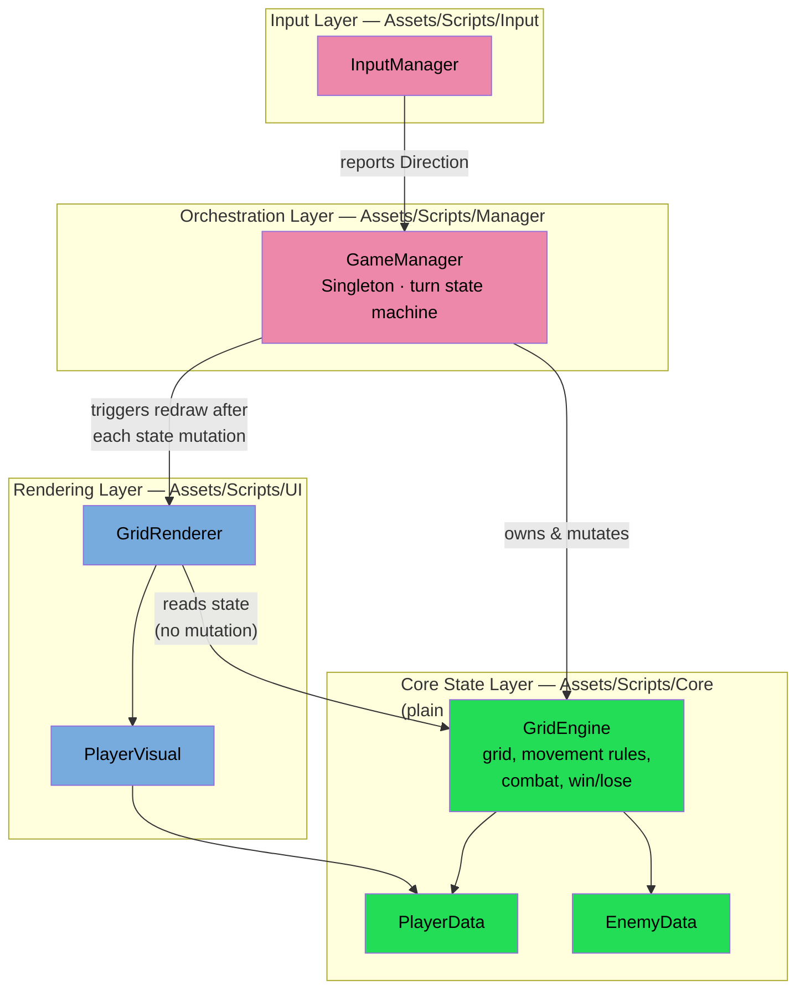
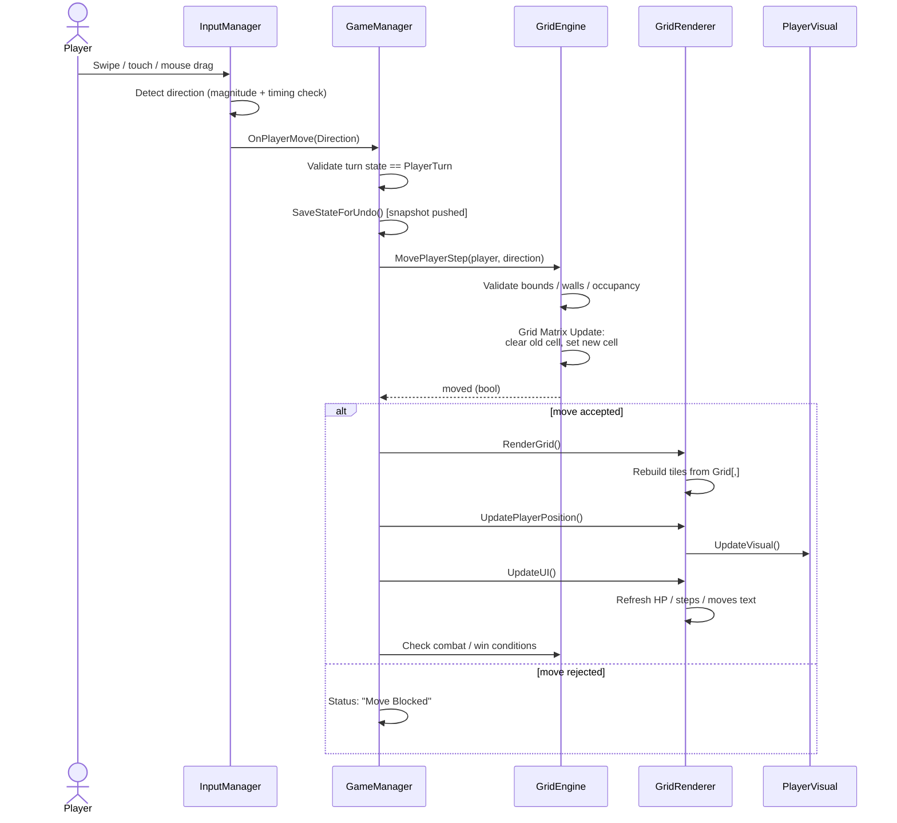

# Grid Quest — Turn-Based Grid Survival Game

A turn-based, dice-driven grid game built in Unity. Players bank movement steps from a die roll, navigate a walled grid toward a center goal, and resolve combat encounters with wandering enemies. Includes a rewindable undo system for the last several moves.

---

## Table of Contents
- [Gameplay Overview](#gameplay-overview)
- [Project Structure](#project-structure)
- [System Architecture Map](#system-architecture-map)
- [Functional Code Flow](#functional-code-flow)
- [Setup / Running the Project](#setup--running-the-project)
- [Contributing / Commit Conventions](#contributing--commit-conventions)

---

## Gameplay Overview

1. Roll a die → banked steps increase (capped at `MaxBankedSteps`).
2. Swipe/drag to spend one banked step per move in a direction.
3. Reaching an enemy tile triggers a dice-off; the loser is removed (enemy) or sent to spawn / killed (player).
4. When banked steps hit zero, turn passes to enemies, who each take a short random walk.
5. Win by reaching the center goal tile. Lose if all players die or the global move budget runs out.
6. Up to 5 prior states can be undone via a rolling snapshot stack.

---

## Project Structure

```
Assets/Scripts/
├── Core/           # Plain C# — no MonoBehaviour, no Unity rendering API calls
│   ├── GridEngine.cs      # Grid state, movement rules, combat rolls, win/lose checks
│   ├── PlayerData.cs      # Player stats (position, health, banked steps)
│   └── EnemyData.cs       # Enemy stats (position, health)
│
├── Manager/        # Orchestration — owns turn flow, wires Core to Input/UI
│   └── GameManager.cs     # Turn state machine, combat resolution, undo stack, win/lose triggers
│
├── Input/          # Input capture only — no game-state knowledge beyond reporting direction
│   └── InputManager.cs    # Swipe/touch/mouse detection → reports Direction
│
└── UI/             # Rendering only — reads Core state, never mutates it
    ├── GridRenderer.cs    # Tile instantiation, HUD text (health/steps/moves)
    └── PlayerVisual.cs    # Per-player sprite + floating name/HP text
```

This folder split is the intended separation of concerns: **`Core/` has zero Unity rendering dependencies** — `GridEngine`, `PlayerData`, and `EnemyData` are plain C# classes with no `MonoBehaviour` inheritance, so game rules can be tested or reused without a scene. `Manager/` is the only layer allowed to call into both `Core/` and `UI/`. `Input/` and `UI/` never reference each other directly.

---

## System Architecture Map

Concrete component relationships, showing the state layer (green), orchestration layer (orange), and rendering layer (blue):



**Decoupling rules enforced by this structure:**
- `Core/` classes never call into `UI/` or `Input/` — they only expose state and pure logic methods (`MovePlayerStep`, `CheckWin`, `RollPowerDie`).
- `InputManager` never touches `GridEngine` or rendering directly — it only reports a `Direction` upward.
- `GridRenderer` and `PlayerVisual` only **read** from `GridEngine`/`PlayerData` to draw the current state; all mutation happens exclusively through `GameManager` → `GridEngine`.
- `GameManager` is the single coordination point — the only class permitted to reference both the state layer and the rendering layer.

---

## Functional Code Flow

Complete lifecycle from a single user gesture through to the rendered frame:



---

## Setup / Running the Project

1. Clone the repository.
2. Open with Unity (see `ProjectSettings/ProjectVersion.txt` for the exact editor version).
3. Open the main scene under `Assets/Scenes/`.
4. Press Play — the grid, player, and enemies are seeded in `GridRenderer.Awake()`.

---
Each commit should represent one logical change — avoid bundling unrelated fixes or large feature drops into a single commit.
