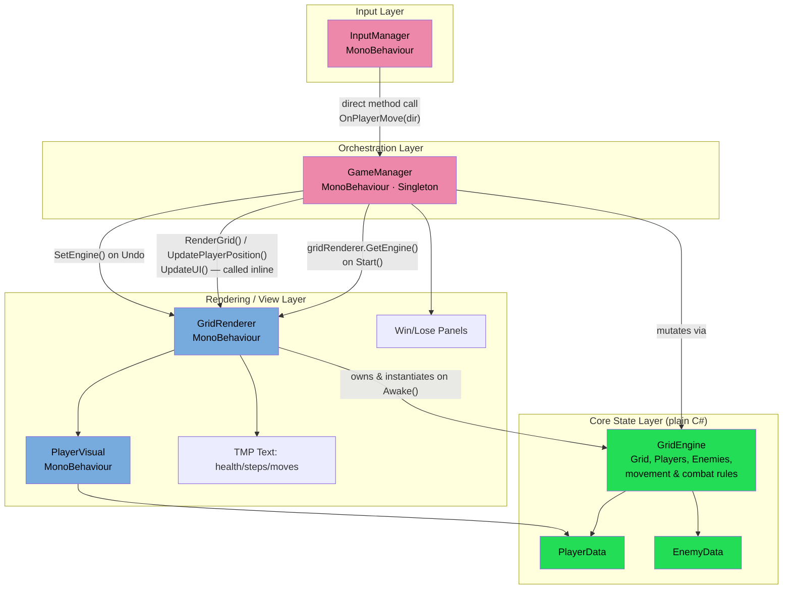
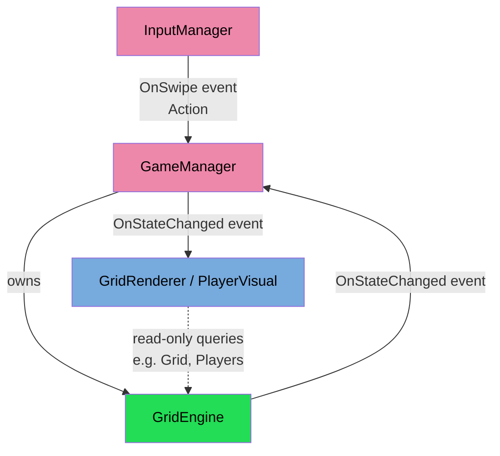
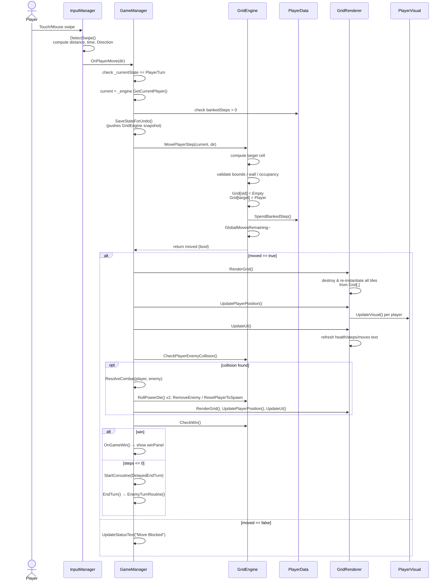

# Unity Grid Game — System Architecture & Code Flow

## 1. System Architecture Map (Current State)

This reflects the actual wiring in your scripts today — including the coupling that currently exists between state and rendering.

### Coupling issues this reveals

1. **State is instantiated by the view.** `GridRenderer.Awake()` does `_engine = new GridEngine(...)` and seeds players/enemies. `GameManager.Start()` then pulls it back out with `gridRenderer.GetEngine()`. The rendering component is currently the *owner* of game state — backwards from a clean architecture where a state/data layer is created independently and handed to both logic and view.
2. **GameManager directly drives rendering.** Nearly every state-changing method (`OnPlayerMove`, `ResolveCombat`, `EnemyTurnRoutine`, `Undo`) ends with explicit calls like `gridRenderer.RenderGrid()`, `UpdatePlayerPosition()`, `UpdateUI()`. There's no event/observer boundary — `GameManager` has a hard compile-time reference to `GridRenderer` and knows its render API.
3. **InputManager calls GameManager directly.** `DetectSwipe()` ends with `gameManager.OnPlayerMove(dir)` — a direct MonoBehaviour-to-MonoBehaviour reference rather than an event (`UnityEvent<Direction>` or a C# `Action<Direction>`) that `GameManager` subscribes to. This means `InputManager` cannot be reused or tested without a live `GameManager`.
4. **Undo re-parents state across the view.** `GameManager.Undo()` pops a `GridEngine` snapshot and calls `gridRenderer.SetEngine(_engine)` — state is being handed *through* the renderer again rather than the renderer simply re-reading from a single shared state owner.
5. **No interfaces.** `GameManager`, `InputManager`, and `GridRenderer` all reference each other's concrete classes. There's no `IInputSource`, `IGameView`, or `IGameState` seam, so you can't swap rendering (e.g., 3D board vs. 2D board) or input scheme (touch vs. AI-driven testing) without editing `GameManager` itself.

### Target (decoupled) shape

- `GameManager` (not `GridRenderer`) constructs `GridEngine` and owns the single source of truth.
- `GridEngine` raises a lightweight event (or `GameManager` raises one after mutating it) that `GridRenderer` subscribes to — rendering never gets an explicit method call telling it *what* changed, just *that* something changed, and reads current state itself.
- `InputManager` exposes an event; it has no reference to `GameManager` at all.

---

## 2. Functional Code Flow — Full Lifecycle

Traced through your actual method calls, from swipe to redraw.

### Where the pipeline breaks the stated ideal

The requested pipeline is **User Gesture → Input Controller → Grid Matrix Update → UI Rendering Framework** — a clean one-directional pipe. In the current code:

- `GameManager` sits *between* input and the grid matrix, which is correct, but it also reaches *past* the grid matrix and calls rendering methods directly (`RenderGrid`, `UpdatePlayerPosition`, `UpdateUI`) after every mutation, rather than the grid matrix update alone triggering a render pass. That means every new state-changing feature you add to `GameManager` (e.g., a new combat rule) requires you to remember to also call the three render methods — nothing enforces that render always follows a state change.
- `RenderGrid()` fully destroys and re-instantiates every tile on **every** move (`foreach (Transform child in gridContainer) Destroy(...)`), rather than diffing which cells changed. This is a rendering-layer efficiency issue riding on top of the coupling issue: because there's no "what changed" event payload, the renderer has no choice but to redraw everything.

If you want, I can sketch the concrete C# event/interface refactor (e.g., `IGameState`, an `OnGridChanged` event) that would close this gap without a full rewrite.
